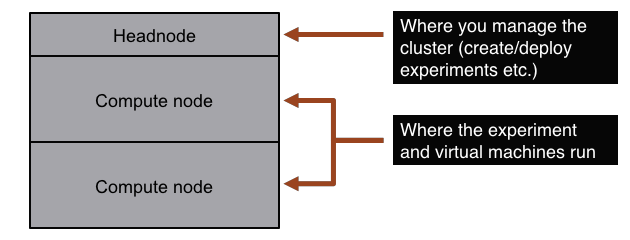
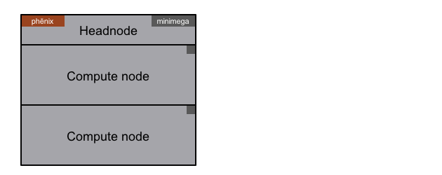
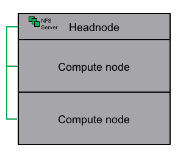
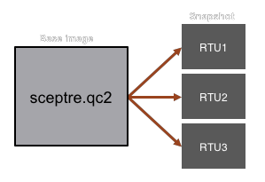

# Cluster Configuration

## Basic Architecture
A SCEPTRE installation requires one [headnode](#headnode) computer and one or more [compute node](#compute-node) computers.

## Headnode
The headnode is the computer where experiment management tools are installed. Virtual machines are not run on this machine, and thus the resource requirements are less than [compute nodes](#compute-node).

### *Minimum Specifications*

- Server or workstation
- 1 CPU
- 2G RAM
- 2 NICs

### *Software Requirements*

1. Ubuntu 20.04 LTS or 22.04 LTS
    - Ubuntu is a Debian-based Linux operating system.
    - Ubuntu Project home: [https://www.ubuntu.com/](https://www.ubuntu.com/)
    - Server or Desktop distributions work, though Server is recommended.
2. [phēnix](https://phenix.sceptre.dev)
    - phēnix is a Sandia-developed tool that manages the creation, configuration, and deployment of experiments. It only needs to be installed on the headnode.
3. [minimega](04-minimega.md)
    - minimega is an open-source, Sandia-developed tool that launches and manages virtual machines across one or more compute nodes. It should be installed on the headnode and then [deployed](04-minimega.md#mesh) to any compute nodes.
    - Project home: [https://www.sandia.gov/minimega/](https://www.sandia.gov/minimega/)

---

## Compute Node
The compute node is the computer where virtual machines run. For a minimal SCEPTRE system, you only need one compute node. However, you can use as many compute nodes as you wish in the cluster.

### *Minimum Specifications*

- Server
- 8 CPU
- 24G RAM
- 2 NICs

### *Software Requirements*

1. Ubuntu 20.04 LTS or 22.04 LTS
    - Ubuntu is a Debian-based Linux operating system.
    - Ubuntu Project home: [https://www.ubuntu.com/](https://www.ubuntu.com/)
    - Server or Desktop distributions work, though Server is recommended.
2. [QEMU](glossary.md#acronyms)
    - To launch virtual machines, minimega uses Quick Emulator (QEMU) as the hypervisor.
    - Project home: [http://wiki.qemu-project.org/Main_Page](http://wiki.qemu-project.org/Main_Page)
3. [Open vSwitch](#open-vswitch)
    - Open vSwitch is a virtual switch providing advanced networking capabilities including [VLAN](glossary.md#acronyms) encapsulation and port-mirroring.
    - Project home: [http://openvswitch.org/](http://openvswitch.org/)

---

## Apt-mirror
Apt-mirror is a small tool that provides the ability to mirror Ubuntu Linux distribution packages. This is useful if you do not have access to the internet to install system packages. Apt-mirror will download and create a local repository of all the Ubuntu packages you specify.

- Instructions on how to set up an apt-mirror for Ubuntu can be found here: [http://blog.programster.org/set-up-a-local-ubuntu-mirror-with-apt-mirror/](http://blog.programster.org/set-up-a-local-ubuntu-mirror-with-apt-mirror/)
- In a typical SCEPTRE installation, the apt-mirror is downloaded and configured on the [headnode](#headnode).

**Warning** - This will require a significant amount of disk space since it downloads entire distribution packages (~200-300GB).

---

## Base KVM images
To launch and configure virtual machines, the headnode and all compute nodes need access to the base [KVM](glossary.md#acronyms) images. These are the 'golden' raw image files that are used by QEMU.

### *Access to images*
To allow all physical hosts access to the base KVM images, a Network File System (NFS) share is installed and configured on the [headnode](#headnode). A NFS allows a system to share directories and files with others over a network. By using NFS, users and programs can access files on remote systems almost as if they were local files. NFS shares are typically installed in a client-server format, with the server hosting the real files, and the clients accessing those files over the network.

- In a SCEPTRE installation, the [headnode](#headnode) acts as the NFS server, with all the images located on an external USB hard drive (for portability and easy backups).
- The [compute nodes](#compute-node) act as NFS clients, and access the images over a network via mounted directories which point to the NFS server.

### *Snapshots*
Instead of creating a KVM image for every virtual machine in an experiment (which could use a lot of disk space), SCEPTRE uses a virtualization technology called snapshots to create custom virtual machines that share a common base image. A snapshot is a small image file containing any changes from the base image that can be used to launch a virtual machine. Multiple snapshot files created from the same base image can all turn into custom virtual machines, but they all share a common parent image. Using this technology greatly reduces the amount of storage requirements for KVM images.

#### Example
A base image called `bennu.qc2` is a plain Ubuntu 16.04 Linux operating system image with [bennu](10-bennu.md) installed. When an experiment is deployed, several snapshots are created from the single 'sceptre' base image. Each of these snapshots becomes a specific simulated SCEPTRE device in a deployed experiment, such as an [RTU](glossary.md#acronyms).

---

## Open vSwitch
Open vSwitch (OVS) is a virtual switch providing advanced networking capabilities including [VLAN](glossary.md#acronyms) encapsulation and port-mirroring. It is installed on all [compute nodes](#compute-node) and serves two primary purposes.

- Bridges virtual machines to the physical host [TDN](02-networking.md#trunked-data-network-tdn).
- Supports adding physical equipment to a virtual experiment via [Hardware-in-the-loop](02-networking.md#open-vswitch) (HIL).
- For more info, see OVS in [Networking Setup](02-networking.md#open-vswitch)
