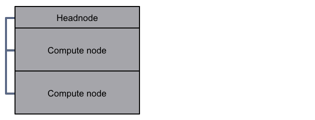
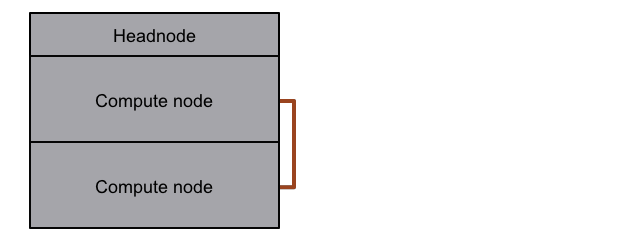
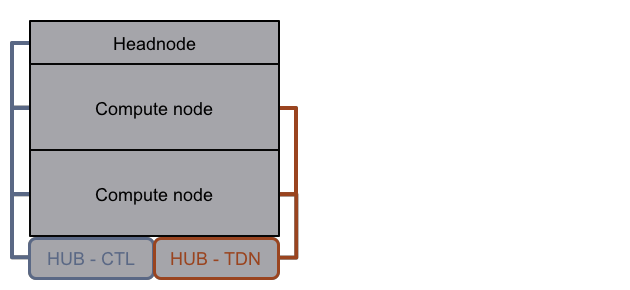
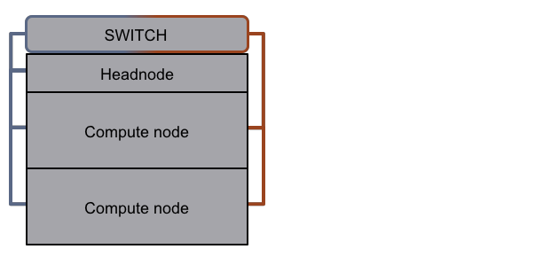
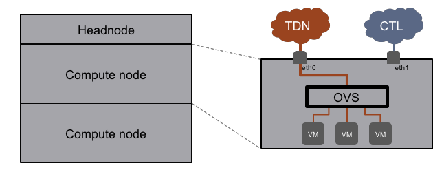
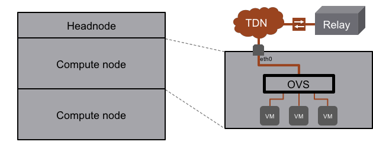
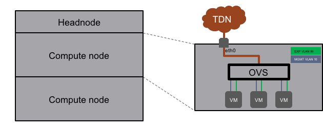

# Networking

A SCEPTRE installation includes several networks, including physical host networks and virtual machine (experiment) networks.

## Physical Hosts
There are two primary networks on the physical hosts ([headnode](01-cluster.md#headnode) and [compute node](01-cluster.md#compute-node)).

### *Control network (CTL)*
This network is used to manage the physical hosts and should have access to the internet or an [apt-mirror](01-cluster.md#apt-mirror).

### *Trunked data network (TDN)*
This network is used to pass [VLAN](glossary.md#acronyms)-tagged experiment traffic between multiple compute nodes.

"Implementation options" - There are two ways to install the network equipment to connect the physical hosts.

1. Two hubs, each dedicated to a specific primary network.
   

2. A single managed-switch, with a set of ports configured for each primary network.
   

## Experiment
When an experiment is deployed, Open vSwitch (OVS) handles all the internal networking to each virtual machine.

### *Open vSwitch*
Open vSwitch (OVS) is a virtual switch providing advanced networking capabilities including [VLAN](glossary.md#acronyms) encapsulation and port-mirroring. It is installed on all [compute nodes](01-cluster.md#compute-node) and controls the networking for an experiment.

- VM to physical network
    - OVS provides the connection from the physical host [TDN](#trunked-data-network-tdn) to each experiment virtual machine.

- Hardware-in-the-loop (HIL).
    - When a virtual experiment needs access to a physical hardware component, OVS acts as a bridge between the two.

### *Internal experiment networks*
There are two internal experiment networks that are handled exclusively by the [TDN](#trunked-data-network-tdn). Although the two experiment networks traverse the same physical network, they are logically separated via [VLAN](glossary.md#acronyms) tagging.

- Experiment (EXP)
    - This network carries packets seen in the 'experiment' world such as [SCADA](glossary.md#acronyms) protocol traffic. It is normally viewed by operators.

- Management (MGMT)
    - This network is a 'dark' network (unseen by normal users). It is used by [bennu](10-bennu.md) to move management data between virtual machines.

