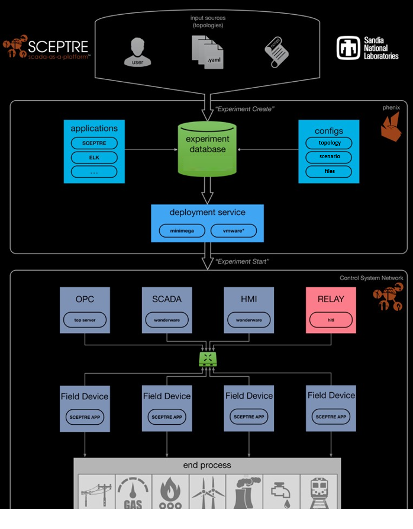

# Workflow

To build an experiment, a network must be defined. The network definition is described in a set of files known as a topology. These files include a "topology" yaml file, an optional "scenario" configuration file and other user configuration files. A topology configuration file describes the physical topology of your network and defines things like the VMs in the experiment, IP addresses, network connections, etc. The scenario configuration file adds additional features to your network as specified by different phēnix user applications.

The first phase in the SCEPTRE workflow is to add your configuration files to the phēnix database and "create" your experiment. 

Once an experiment is created, the second phase in the SCEPTRE workflow is starting/deploying the experiment.

phēnix gives the experiment information to minimega which uses that data to boot virtual machines, inject configuration files, configure networking, and start the experiment.

The SCEPTRE workflow diagram includes various system components that combine to show the lifecycle of an experiment from network description to deployed virtual machines in an ICS environment.

