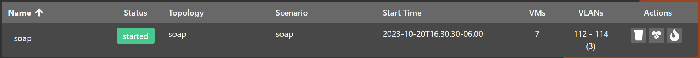
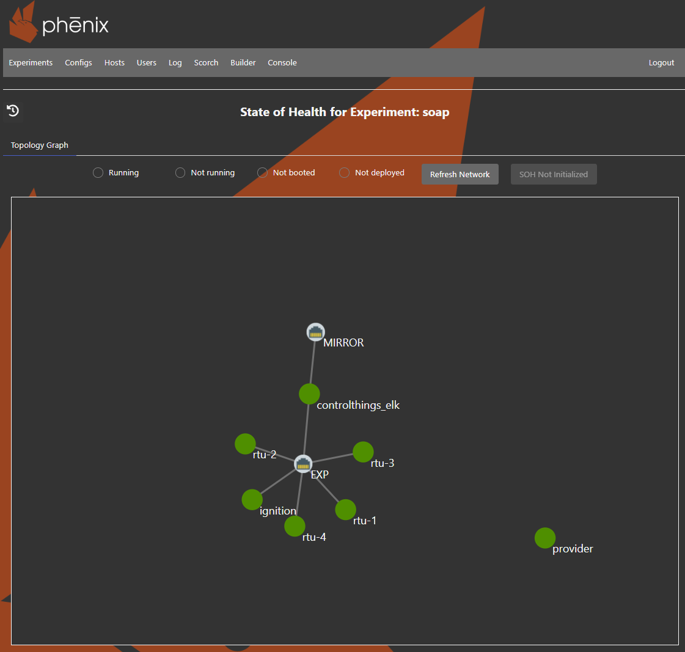

# State of Health

The SCEPTRE architecture provide users with additional situational awareness for each deployed experiment. The State of Health (SoH) dashboard was designed to display comprehensive information of the status of each device in an experiment. Users can use the SoH dashboard to quickly identify all devices in an error-state, and then take appropiate measures to address the issue. 

The [SoH](glossary.md#acronyms) dashboards are useful in pinpointing specific problems within the experiment and ensuring, among other things:

+ virtual SCEPTRE devices deployed properly and they have all their required network connections.
+ the end process simulation is running properly and successfully solved for a new solution.
+ verifying red team actions

The [SoH](glossary.md#acronyms) dashboards were developed in a hierarchical fashion to enable troubleshooting from the top down. The *Global State of Health* dashboard provides a highest-level view of the experiments and presents the user with an overview of all VMs' state. Users can use the Global State of Health to visualize which experiments have VMs in error state and dive into more detailed view *VM SoH Dashboard* to pinpoint the problem.  

The *VM SoH Dashboard* provides a view of all virtual SCEPTRE devices deployed in the experiment and their current state. Here users can identify the specific device(s) that are problematic. VMs can be in four states (1) running, (2) not running, (3) not booted, and (4) not deployed. From here, users can dive down into the specific problematic device(s) and restart it. Users have the capability to also terminate or pause a running VM.

> NOTE: To Ensure your dashboards stay up to date with the most recent data users must refresh the VM SoH Dashboard on every change.

## Global State of Health
The Global State of Health is the initial screen on which users can visualize a high-level overview of the state of each experiment. From this view users can identity any problem in an experiment and select it to display more detailed information in the main SoH dashboard.

## VM SoH Dashboard
The main SoH dashboard shows a network view of all VMs in the selected experiment. From the diagram view, users can start/pause/kill any VM in the experiment. To reduce the time to pinpoint error-state VMs in large experiments, users can filter the diagram (top-right corner) to display only desired VMs. Selecting a specific VM within the diagram will display overall information of the VM's attributes. 

### SoH Dashboard Functions
The SoH dasboard has two main functionalities, (1) a filter to only display specific-state VMs, and (2) an overlay window on which users can review general information regarding the VM's attributes and they can also pause/start/kill the selected VM.

#### VM overview window
After selecting a VM, users will be presented with an overlay window. The information and option available in the window will depend in the state of each VM. 

#### Dashboard Filter
The filter in the SoH dashboard reduces the time that users need to identify error-state VMs in large experiments. Users can filter the network diagram by the possible states of a VM 

1. **Running VMs:** In this state the VM is running normally without disruptions. 

2. **Error-state VMs:** The error state represents the VMs that are currently deployed but are not running. Not running in this scenario means that the VM was paused or shutdown by an user.  

3. **not deployed VMs:** This state represents VMs that should be in the experiment but are not. To be in this state, the VM could be killed by an user or it failed to start during experiment's setup.

4. **not booted VMs:** The not booted state represents VMs that were set not to boot during experiment's setup. In this case a not booted state is consider normal. 
