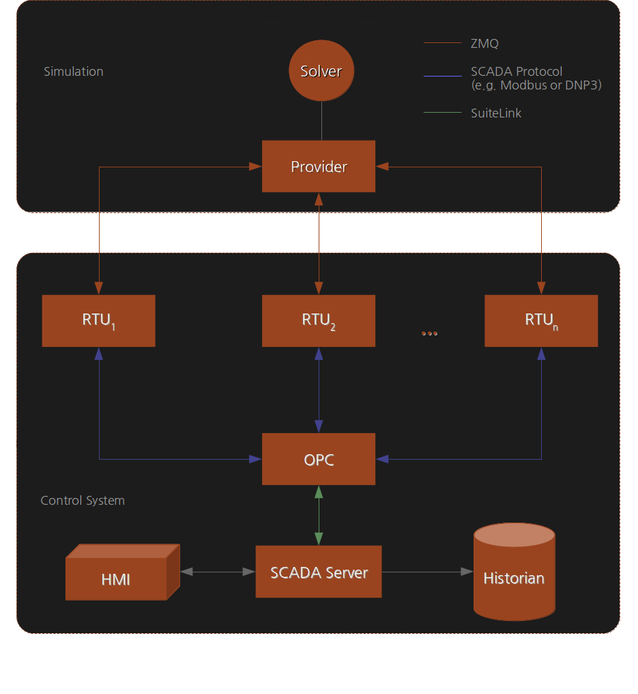

# The SCEPTRE User App
The SCEPTRE user App provides a means for adding ICS specific details to a topology. The app helps:

- startup the physical process simulation
- communicate data between the physical process simulation and the the field devices
- configure field device I/O and logic
- communicate via full-fidelity SCADA protocols between field devices and various SCADA software
- configure various SCADA software

Ultimately, the app generates configuration files and start up scripts so that upon experiment start up, all the ICS components are automatically configured and started up on boot of the VMs, creating an environment for the user free of manual start up steps. Without the SCEPTRE app, phēnix can still be used to create topologies or orchestrate VM deployment, however your experiment will either not have any ICS components or you will have to hardcode these components into your VMs.

## Components of SCEPTRE


This diagram is a high-level depiction of a typical SCEPTRE experiment deployed by phēnix. It abstracts away any hardware and some networking details (physical and virtual) to present a simplified view of the experiment construct.

The large grey boxes represent a conceptual partition of the experiment layout. The two partitions are

1. Simulation
2. Control System


### Simulation Partition
The simulation partition handles simulation of the physical process and the initial distribution of process data to the control system. It has two components: the solver and the provider. The solver generates physical process state data by, for example, numerically integrating a dynamic systems model from an initial condition. The solver also updates state data whenever it receives control system updates. The provider acts as an interface that enables the solver to receive and transmit data to and from the control system. The provider communicates to the control system via UDP multicast traffic over ZMQ sockets. Field device communication with the provider occurs over TCP using ZMQ sockets.

SCEPTRE's management network [MGMT](02-networking.md#internal-experiment-networks) is used to move purely simulated data from the simulated physical process model to the SCEPTRE field devices that are monitoring and controlling the process. The MGMT network operates in the `172.16.0.0/16` address space. All the following connections are on the MGMT network and are not visible "in-game".

| Port | Description |
|------|-----------|
|40000|```provider --> field device``` published data is sent to field devices|
|5555|```field device --> provider``` upstream data transfer connection: registration, updates|
|22|SSH port for connecting to devices for troubleshooting and updates|

Currently SCEPTRE supports integration with PowerWorld, PowerWorld Dynamic Studio, PyPower, MATLAB Simulink, [OpenDSS](https://www.epri.com/pages/sa/opendss), [RTDS NovaCor](https://www.rtds.com/), and others.

### Control System Partition
The control system partition represents the emulated control system network. The network traffic seen on all the links contained within the control system partition emulates the traffic that would been seen on a real physical control network with the same topology as in the experiment.

#### Field Devices
From the point of view of the control system, the [MGMT](02-networking.md#internal-experiment-networks) connection from the provider to field devices (such as RTUs or PLCs) is analogous to retrieving sensor data for a device on a physical plant. Thus, a field device gets simulated plant data from a [MGMT](02-networking.md#internal-experiment-networks) connection. Likewise, a field device sends control system updates to the simulated plant through another [MGMT](02-networking.md#internal-experiment-networks) connection.

Additionally, a field device will send data upstream to other control system devices via various SCADA protocols. Since this traffic emulates the traffic that is seen in the real control network, this traffic traverses the [EXP](02-networking.md#internal-experiment-networks) network. The SCADA protocols modeled in SCEPTRE use standard ports for communications and include:

| Port | Protocol | Description |
|------|--------|-----------|
|5413|Suite Link|Communication between the SCADA server and the OPC server used by SCADA software|
|502|ModbusTCP|TCP/IP variant of the Modbus protocol to communicate between SCADA systems and field devices|
|20000|DNP3|Distributed Network Protocol used to communicate between SCADA systems and field devices|
|2404|IEC 60870-5-104|Network transmission protocol for SCADA control of automated systems|
|4840|OPC UA|Communication between the OPC server and a SCADA server|
|32568|Suite Link|Used for communication between historian machines for replications (applies to certain SCADA software)|

Additional SCADA protocols can be integrated into SCEPTRE by including the appropriate protocol stack in the [bennu](https://github.com/sandialabs/sceptre-bennu) codebase.

#### OPC

A control process could contain different hardware endpoints, each potentially using different hardware communication protocols. A device is needed to translate/convert the various protocols into a common protocol used by other services, such as a Human Machine Interface (HMI). This conversion device is known as an OPC server (**O**bject Linking and Embedding for **P**rocess **C**ontrol or more recently **O**pen **P**latform **C**ommunications). An OPC server converts hardware communication protocols used by various control process endpoints into a single OPC protocol.

The OPC server listens to all of the RTUs and maps their addresses, names, values and other parameters to a generic object, or 'tag'. This tag, or reference, is how the HMI interacts with the RTUs. Much of this configuration is automated via the SCEPTRE app, making it easier for the user.

Currently, the SCEPTRE app uses [TOP Server](https://products.softwaretoolbox.com/top-server/opc-da-ua-suitelink-drivers) for the OPC server. However, other software packages can be used instead. Adding these other options to the SCEPTRE app is as easy as understanding how the desired software package is configured and automating the generation of the appropriate configuration file and creating a new start up script to start the right software package.

#### SCADA Server

A SCADA server acts as the centralized unit of control in ICSs. It "serves" data from the OPC server to other devices such as Human Machine Interfaces (HMIs). The SCADA server configuration is dependent on the successful configuration of the OPC server. Manually changing a name or address on the OPC server will have a ripple effect, resulting in the HMI displaying inaccurate information.

The SCADA server configuration usually requires some sort of graphical display of the system. Graphical display creation is difficult to fully automate, thus the SCEPTRE app requires that a user has already created this graphical display of the system.

Currently, the SCEPTRE app uses [mySCADA](https://www.myscada.org/en/) for the SCADA server. However, other software packages can be used instead. Adding these other options to the SCEPTRE app is as easy as understanding how the desired software package is configured and automating the generation of the appropriate configuration file and creating a new start up script to start the right software package.

#### Human-Machine Interface (HMI)

An HMI client simply displays the live display of the status of the system as configured by the SCADA server.

In SCEPTRE, the HMI is dependent upon the SCADA server. Using the mySCADA software for the SCADA server, the HMI simply displays the HMI through http in a web browser. However, other software packages can be used instead. Adding these other options to the SCEPTRE app is as easy as understanding how associated SCADA server software is configured and a new startup script to query the state of the SCADA server.

#### Data historian

A data historian is a centralized database for logging all information within and ICS environment. Unlike the OPC or SCADA server which contain only the current snapshot of the system, the historian temporally logs data over time and is therefore used for activities such as database queries, trend analysis, and other advanced analysis.

Currently, the SCEPTRE app uses [Wonderware Historian](https://www.aveva.com/en/products/historian/) for the data historian. However, other software packages can be used instead. Adding these other options to the SCEPTRE app is as easy as understanding how the desired software package is configured and automating the generation of the appropriate configuration file and creating a new start up script to start the right software package.

#### Engineering Workstation

An engineering workstation is a machine periodically used to program field devices.

In SCEPTRE, the engineering workstation if configured so that it can access field devices via [PuTTY](https://en.wikipedia.org/wiki/PuTTY).

## Usage

The SCEPTRE app is configured by specifying the desired configurations in a scenario configuration file. The following metadata fields are associated with each type of device.

### Provider

- `type: provider`
- `simulator`: Specifies the type of simulator used. Current options are: `PowerWorld`, `PowerWorldDynamics`, `PowerWorldHelics`, `PyPower`, `Simulink`, `RTDS`, `OpenDSS`, `Alicanto`
- `publish_endpoint`: Endpoint address for the UDP multicast traffic from the provider. Default value if unset is `udp://*;239.0.0.1:40000`.
- `case`: If using a PowerWorld provider, this is the associated PowerWorld case file for the physical process simulation. If using a PyPower provider, this is the associated PyPower case file for the physical process simulation.
- `oneline`: If using a PowerWorld provider, this is the associated PowerWorld oneline diagram for the physical process simulation.
- `pwds_endpoint`: If using a PowerWorldDynamics provider, this is the endpoint for the solver. Default is `127.0.0.1`.
- `solver`: If using a Simulink provider, this is the compiled executable for the physical process simulation.
- `publish_points`: If using a Simulink provider, this is a list of tags form the physical process simulation for the provider to publish to the field devices.
- `gt`: If using a Simulink provider, this is the compiled executable for the ground truth data from the physical process simulation. Note that this is not required for the provider to function, this is a optional feature.
- `gt_template`: If using a Simulink provider, this is the web template for displaying the ground truth data from the physical process simulation. Note that this is not required for the provider to function, this is a optional feature.
- `hil_tags`: If using [HIL](glossary.md#acronyms), a list of tags from the provider that will be sent to the HIL devices.

### Field Device

- `type`: Field device type. Types: `fd-server`, `fd-client`, or `fep`.
- `provider`: Hostname of the provider that the field device is getting data from.
- `infrastructure`: Type of infrastructure that the provider is modeling. Types include: `power-transmission`, `power-distribution`, `batch-process`, `hvac`, `fuel`, `rtds`, `waterway`, and `battery`.
- `logic`: If specified, this contains any logic that the field device will be applying to input from the provider and writing back to the provider. The logic is implemented using [cparse](https://github.com/cparse/cparse). Refer to the cparse README for available operators, and the example below for example logic (as well as the open-source topology examples at [sceptre-phenix-topologies](https://github.com/sandialabs/sceptre-phenix-topologies)).
- `cycle_time`: If specified, this determines at what rate the field device goes through an input/logic/output cycle.
- `dnp3`, `dnp3-serial`, `modbus`, `modbus-serial`, `bacnet`, or `iec60870-5-104` If specified, one of these keys define what SCADA protocols the device will speak using the selected tags.
    - `name`: Name of the tag.
    - `type`: Type of component as it maps to the infrastructure of the associated provider.
- `connected_rtus`: If type `fd-client` or `fep`, this is a list of other field devices which serve data to this device.

### OPC Server

- `type: opc`
- `connected_rtus`: List of field devices to be used in the OPC configuration

### SCADA Server

- `type: scada-server`
- `project`: Project file for mySCADA software. If no project file is given, a project file will be created using the OPC config to create a basic HMI with a list of all tag names and associated tag values. 
- `automation`: Automation file for mySCADA software start up. If no automation file is given, an alternative method of automation described in the SCEPRTE app template for the SCADA server startup (<https://github.com/sandialabs/sceptre-phenix-apps/blob/main/src/python/phenix_apps/apps/sceptre/templates/scada.mako>) will be used, but this auotmation may have issues depending on VM screen resolution depending on your build. 

### HMI
- `type: hmi`
- `connected_scadas`: A list of scada servers for this HMI to connect to. If empty, it will connect to any scada servers on the same subnet.

### Data historian

- `type: historian`
- `fields`: A list of field types the historian will monitor. If empty, the historian will monitor all fields.
- `primary`: Boolean specifying if the historian is the primary historian.
- `connecttoscada`: Boolean specifying if the historian connects to the SCADA server. If empty, the historian will connect to the OPC server.

### Engineer Workstation

- `type: engineer-workstation`
- `connected_rtus`: A list of field devives for the the engineer workstation to create connections to.
- `connect_interval`: A interval (seconds) that the engieer workstation will use between autoconnections made to the list of `connected_rtus` using WinSCP. If empty, the engieer workstation will not autoconnect to the field devices.

## Example

The following is an example configuration of the SCEPTRE app. In this example, there is one physical process provider of a water way lock. There are two RTUs that monitor the lock and open/close gates based on logic defined in the config file. The OPC server monitors these two RTUs and then rest of the upstream SCADA software monitors and displays the data from the OPC server. The engineer workstation is has PuTTY configured to connect to the RTUs, and will automatically connect to them every 60 seconds.

```yaml
- name: sceptre
  assetDir: /phenix/topologies/waterway
  hosts:
  - hostname: simulink-provider
    metadata:
      gt: /phenix/topologies/waterway/injects/simulinkgt
      gt_template: /phenix/topologies/waterway/injects/main.tmpl
      publish_endpoint: udp://*;239.0.0.1:40000
      publish_points: /phenix/topologies/waterway/injects/publishPoints.txt
      simulator: Simulink
      solver: /phenix/topologies/waterway/injects/simulinksolver
      type: provider
  - hostname: rtu-1
    metadata:
      modbus:
      - name: lowerwater
        type: water
      - name: lock
        type: water
      - name: lowergate
        type: gate
      - name: lowervalve
        type: valve
      - name: lowersensor
        type: boat-sensor
      - name: locksensor
        type: boat-sensor
      infrastructure: waterway
      logic: lowergate.open = 1*((lowersensor.direction == 1) && (lowersensor.active == 1) && (lock.height >= lowerwater.height - 0.1) && (lock.height <= lowerwater.height + 0.1)) + 0*((locksensor.direction == 1) && (locksensor.active == 1) && (lock.height >= lowerwater.height - 0.1) && (lock.height <= lowerwater.height + 0.1)) + 1*((locksensor.direction == -1) && (locksensor.active == 1) && (lock.height >= lowerwater.height - 0.1) && (lock.height <= lowerwater.height + 0.1)) + 0*((lowersensor.direction == -1) && (lowersensor.active == 1)); lowervalve.open = 1*((lowersensor.direction == 1) && (lowersensor.active == 1) && (lock.height > lowerwater.height)) + 0*((locksensor.direction == 1) && (locksensor.active == 1) && (lock.height >= lowerwater.height)) + 1*((locksensor.direction == -1) && (locksensor.active == 1) && (lock.height > lowerwater.height)) + 0*((lowersensor.direction == -1) && (lowersensor.active == 1))
      provider: simulink-provider
      type: fd-server
  - hostname: rtu-2
    metadata:
      modbus:
      - name: upperwater
        type: water
      - name: lock
        type: water
      - name: uppergate
        type: gate
      - name: uppervalve
        type: valve
      - name: uppersensor
        type: boat-sensor
      - name: locksensor
        type: boat-sensor
      infrastructure: waterway
      logic: uppergate.open = 1*((locksensor.direction == 1) && (locksensor.active == 1) && (lock.height >= upperwater.height - 0.1) && (lock.height <= upperwater.height + 0.1)) + 0*((uppersensor.direction == 1) && (uppersensor.active == 1)) + 1*((uppersensor.direction == -1) && (uppersensor.active == 1) && (lock.height >= upperwater.height - 0.1) && (lock.height <= upperwater.height + 0.1)) + 0*((locksensor.direction == -1) && (locksensor.active == 1) && (lock.height >= upperwater.height - 0.1) && (lock.height <= upperwater.height + 0.1)); uppervalve.open = 1*((locksensor.direction == 1) && (locksensor.active == 1) && (lock.height < upperwater.height)) + 0*((uppersensor.direction == 1) && (uppersensor.active == 1)) + 1*((uppersensor.direction == -1) && (uppersensor.active == 1) && (lock.height < upperwater.height)) + 0*((locksensor.direction == -1) && (locksensor.active == 1) && (lock.height >= upperwater.height - 0.1) && (lock.height <= upperwater.height + 0.1))
      provider: simulink-provider
      type: fd-server
  - hostname: opc
    metadata:
      connected_rtus:
      - rtu-1
      - rtu-2
      type: opc
  - hostname: scada-server
    metadata:
      automation: /phenix/topologies/waterway/injects/myscada.exe
      project: /phenix/topologies/waterway/injects/waterway.mep
      type: scada-server
  - hostname: hmi
    metadata:
      type: hmi
  - hostname: historian
    metadata:
      type: historian
  - hostname: engineer-workstation
    metadata:
      connected_rtus:
      - rtu-1
      - rtu-2
      connect_interval: 60
      type: engineer-workstation
```

## Debugging
If using the SCEPTRE app correctly, the startup of all VMs in your experiment should be automated. If your experiment is not operating as expected, there are some things to start verifying:

1. Start by verifying the SCEPTRE app created the appropriate config files and startup scripts. These files are located in `/phenix/experiments/<exp_name>/sceptre`.
2. Verify the files generated by the SCEPTRE app were injected into the VMs. Looking at `/phenix/experiments/<exp_name>/mm_files/<exp_name>.mm` to see the location of the injects on each VM.
3. If the injects exist on the VM, run the start up scripts manually to help debug. On Linux VMs, the start up scripts are located under `/etc/phenix/startup` and on Windows VMs the start up scripts are in `C:\phenix\startup`.
