# SCEPTRE Field Device User Guide

## **Connecting to Brash Shell**

On the “system tools” section of the engineer-workstation desktop,

double-click on “putty.exe”.

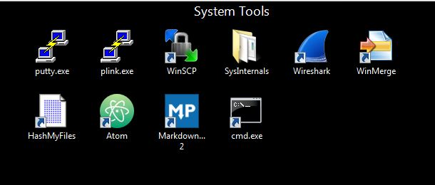

Once PuTTY is open, double click on the field device you would like to connect
to. Ensure that you are connecting via telnet with port 1337.

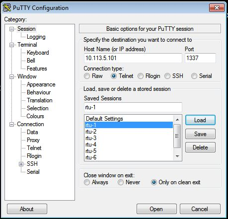

Once you’re connected to the field device, login to the brash shell with the
following credentials:

**Username: `sceptre`**

**Password: `sceptre`**

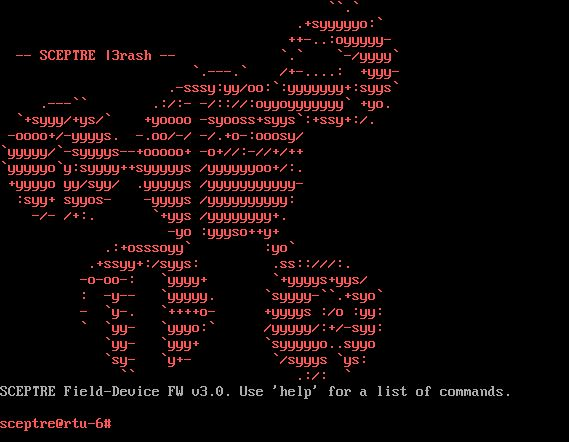

## **Shell Commands**

**`help`:** Displays all supported commands with respective descriptions.

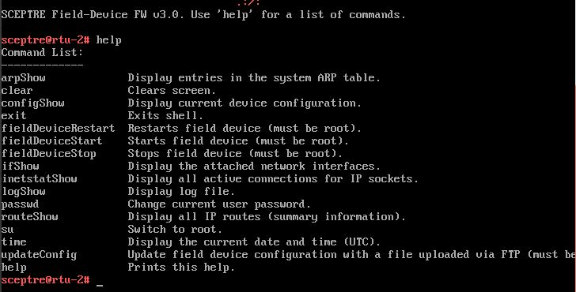

**`arpShow`:** Displays the system ARP table entries.

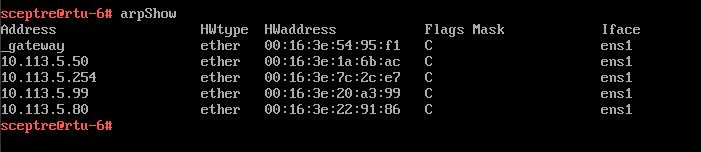

**`clear`:** Clears the terminal screen.

**`configShow`:** Displays the configuration file using the text editor vi in the terminal

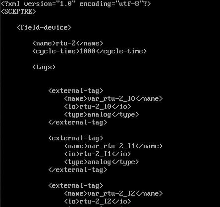

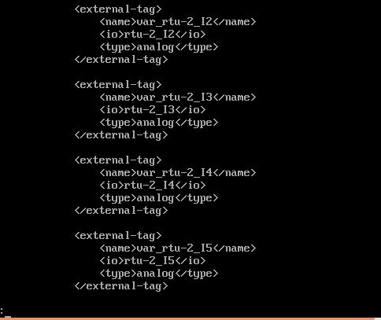

**`exit`:** Exits the shell and returns the user to the Brash login prompt.

**`FieldDeviceRestart`:** Stops and restarts the field device daemon and
displays the PID before and after restarting.

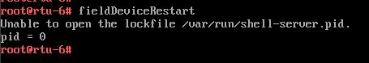

**`fieldDeviceStart`:** Initializes the RTU field device daemon and gives it a
PID. If the field device daemon is not running, PID will be 0 as in the first
image. The second image is the message if the field device is already running
and cannot be started.

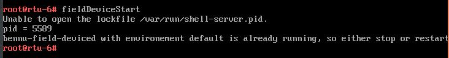

**`FieldDeviceStop`:** Stops the RTU field device daemon and displays its PID.

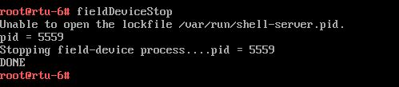

**`ifShow`:** Displays system network interfaces.

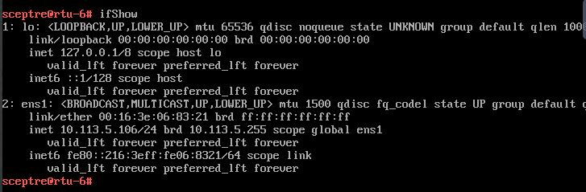

**`inetstatShow`:** Displays all active IP socket connections.

**`logShow`:** Displays the log for the current field device and the firmware
version.

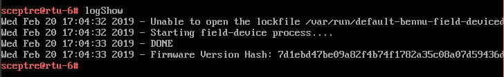

**`passwd`:** Change user password.

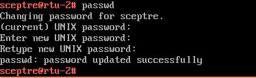

**`routeShow`:** Displays all IP routes.

**`su`:** Switch to brash root account. (Password: admin)

**`time`:** Displays the system time.

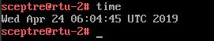

**`updateConfig`:** Updates the field device configuration with a file
uploaded over FTP. In order to perform this action, must first be root. If the
user is not root, the following error message will be displayed

## **Connecting as Administrator**

**Note**: This method is only accessible from the MGMT network (172.16.0.0/16).

On the “system tools” section of the engineer-workstation desktop,
double-click on “putty.exe”.

Once PuTTY is open, double click on the field device you would like to connect
to. Ensure that you are connecting via ssh with port 22 using MGMT network IP
addresses.

Once you're connected to the field device, login with the following credentials:

**Username: `root`**

**Password: `SiaSd3te`**
