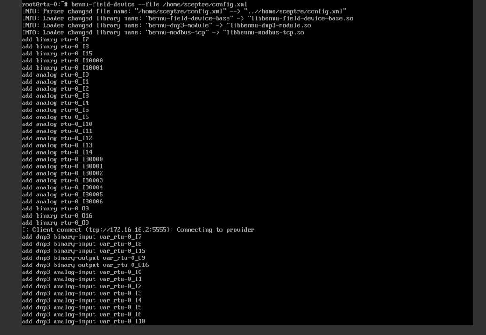
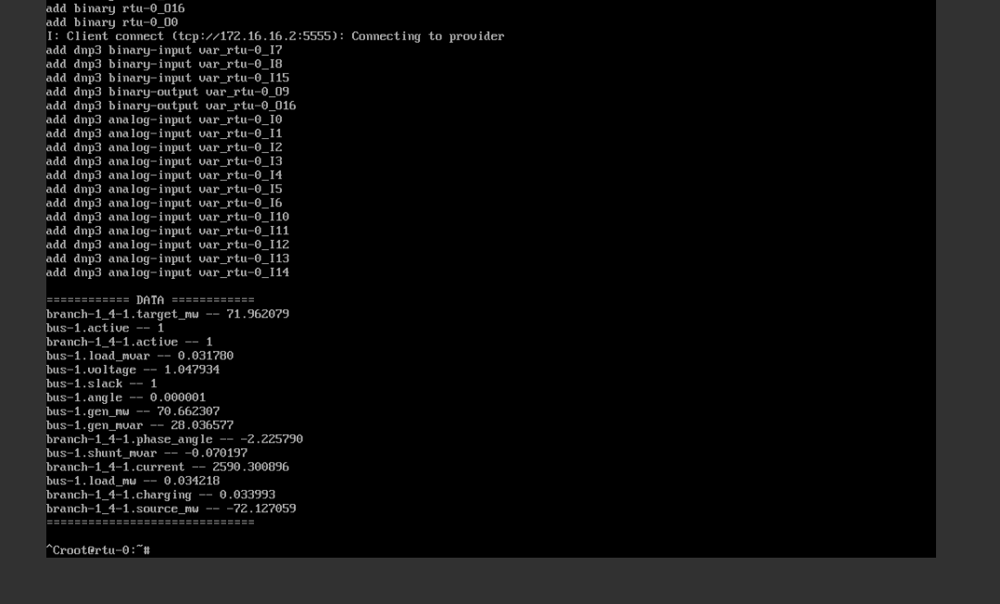
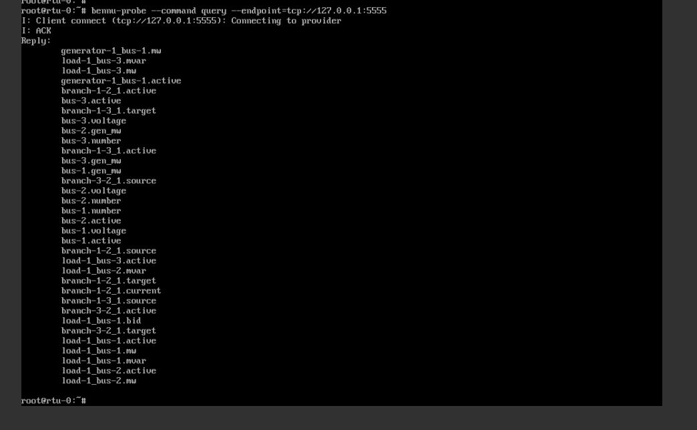
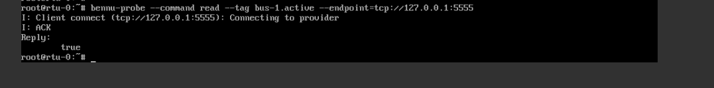
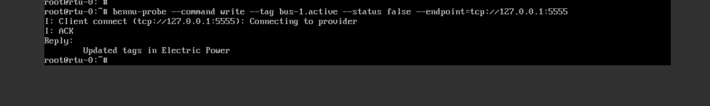
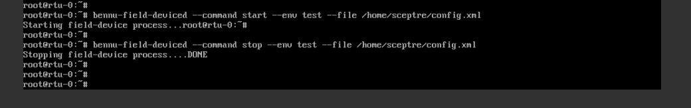
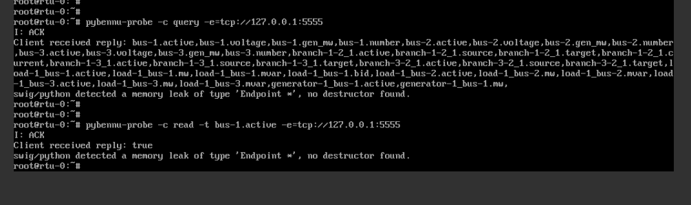
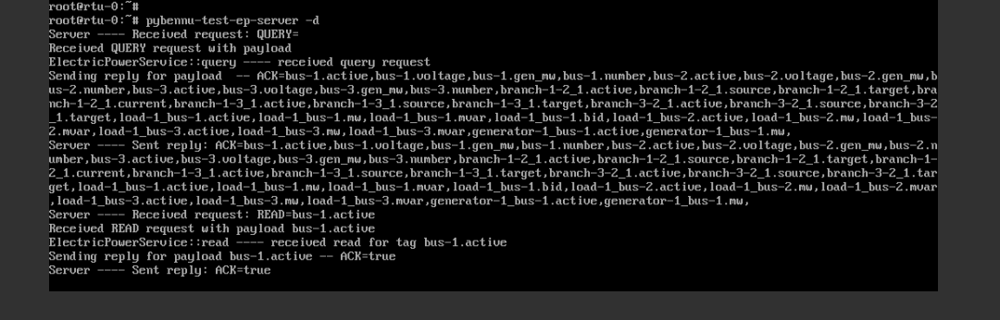
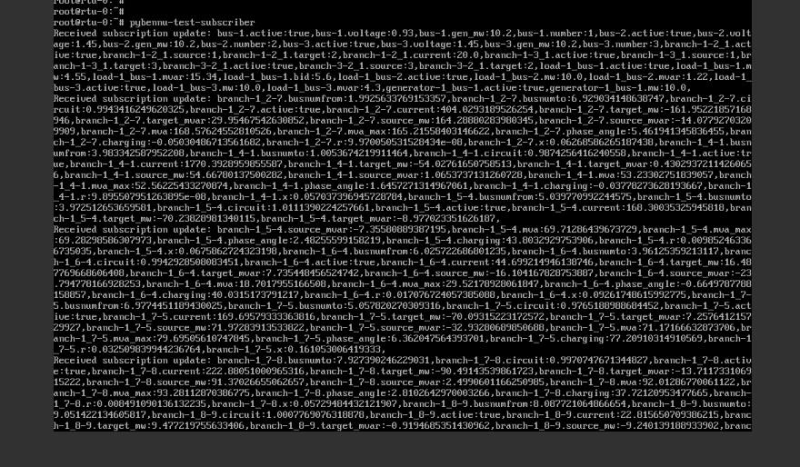

# bennu
Bennu and Pybennu are both installed on the `bennu.qc2` image that is used for most virtual RTUs in SCEPTRE. This image is open-source, and can be downloaded from [sceptre-phenix-images](https://github.com/sandialabs/sceptre-phenix-images) on GitHub using [ORAS](https://oras.land/docs/installation/):

```shell
cd /phenix/images/
oras pull ghcr.io/sandialabs/sceptre-phenix-images/bennu.qc2:latest
```

Both of these programs have some useful command line executables that can be used in SCEPTRE experiments to troubleshoot or force changes in the experiment.

## Bennu CLI

### bennu-brash

- Quick access to the brash UI on bennu
- This is the default login shell for the `sceptre` user, e.g. if connected to the field device with SSH and username `sceptre`
- Example: `bennu-brash`

### bennu-field-device

- Used to start a bennu-field-device simulation based on a given config. It will periodically output its current state for the tags detailed in the config
- Will print out the current values of the tags specified in the config
- Use `--help` to get options
- Use `--file` to specify the config you want to use
- Example: `bennu-field-device --file /home/sceptre/config.xml`





### bennu-probe

- Command line probe for querying/reading/writing values to/from a bennu field device or provider
- Useful for affecting specifc tags on a device
- Use `--help` to get all options
    - Note for the specific examples below, a server needs to be running on the field device hence the endpoint being the loopback address
- Query example: `bennu-probe --command query --endpoint=tcp://127.0.0.1:5555`
- Read example: `bennu-probe --command read --tag bus-1.active --endpoint=tcp://127.0.0.1:5555`
- Write example: `bennu-probe --command write --tag bus-1.active --status false --endpoint=tcp://127.0.0.1:5555`







### bennu-simulink-provider

- Starts the simulink provider
- This is not usually invoked by users, and is usually invoked by a startup script injected by the SCEPTRE app.

### bennu-field-deviced

- Simulate running a bennu field device with a given config file. Useful when testing new or custom bennu rtu configs
- This tool has slightly more functionality than `bennu-field-device` as it can be run as a daemon
- Use `--help` to get all options
- Must give a `--command` argument of start, stop, or restart
- `--env` gives the option to give the simulation a string identifier
- Start example: `bennu-field-deviced --command start --file /home/sceptre/new_config.xml`



### bennu-watcherd

- A watcher for a basic field-device daemon in bennu
- This is automatically started by a script injected by the SCEPTRE app.

### bennu-test-bp-server

- Batch process test worker service
- A test server and provider with predefined points which can be used for testing once it is running
- Use `--help` to get all options
- For example, can be run and then probed by bennu-probe
- Example: `bennu-test-bp-server`

### Bennu-test-ep-server

- Electric process test worker service
- Same as above, may be more useful as the predefined tags are more power related
- Use `--help` to get all options
- Example: `bennu-test-ep-server`


## Pybennu CLI

### pybennu-probe

- Very similar to `bennu-probe` but written in Python
- Use `-h` to get all options
    - Note for the specific examples below, a server needs to be running on the field device hence the endpoint being the loopback address
- Query example: `pybennu-probe -c query -e=tcp://127.0.0.1:5555`
- Read example: `pybennu-probe -c read -t bus-1.active -e=tcp://127.0.0.1:5555`
- Write example: `pybennu-probe -c write -t bus-1.active -s 0 -e=tcp://127.0.0.1:5555`



### pybennu-test-ep-server

- Similar to above, this preforms essentially the same functionality as `bennu-test-ep-server`
- Use `-h` to get all options
- Example: `pybennu-test-ep-server`



### pybennu-test-subscriber

- This feature subscribes to a running server/publisher and will print the published points to the screen
- Good for debugging and making sure that a publisher is giving the expected values for multiple tags in real time.
- Use `-h` to get all options
    - Note for the specific examples below, a server needs to be running on the field device hence the endpoint being the loopback address
- Run with no options: `pybennu-test-subscriber`



### pybennu-power-solver

- This runs the power daemon code that is written for pybennu
- This is usually run by a startup script injected by the SCEPTRE app
- It requires a `.ini` config file to run (usually named `config.ini`)
- The `.ini` file requires specifying how the power daemon will run and which power provider will be monitored and started by the daemon
- The RTDS and OPAL-RT providers require a `.yaml` config to run, in addition to `config.ini`. The path to this YAML file is specified in the `config.ini`.

### pybennu-siren

- This runs the siren feature of pybennu used for HIL
- Needs a `-c` config file and `-d` array of devices listed in the config file
- This will launch siren according to the config

## Logs
- Startup script logs: `journalctl -u phenix`
- C++ bennu logs: `/etc/sceptre/logs/*.log`
- pybennu logs: `/var/log/bennu-pybennu.{out,err}`
    - To follow: `tail -f /var/log/bennu-pybennu.*` (or the alias `plogs` on the `bennu.qc2` image)
