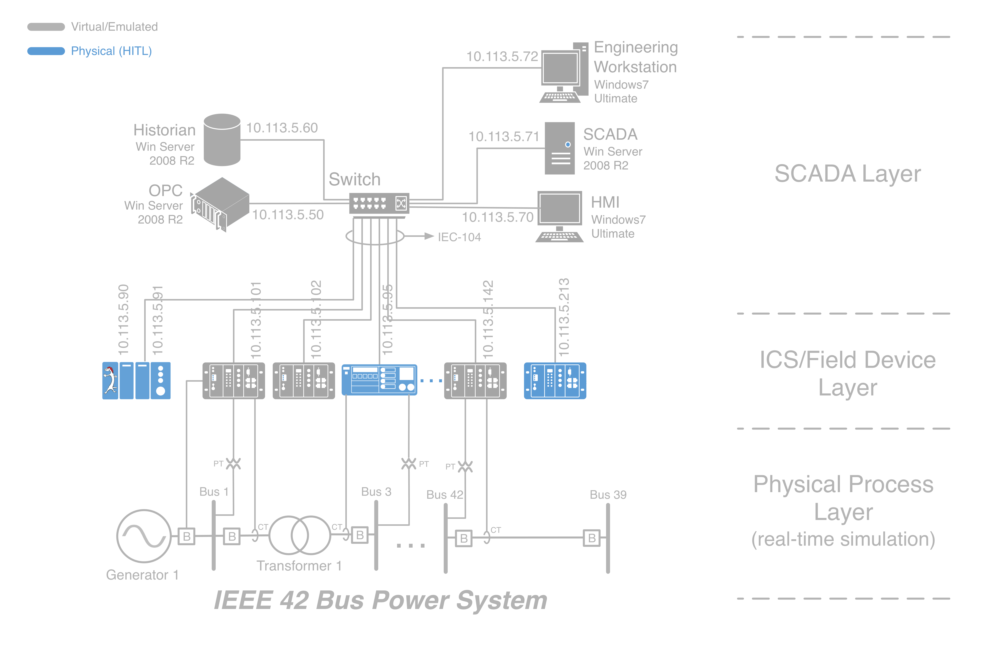
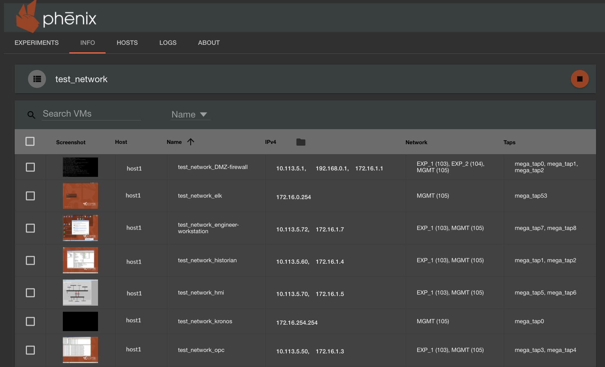
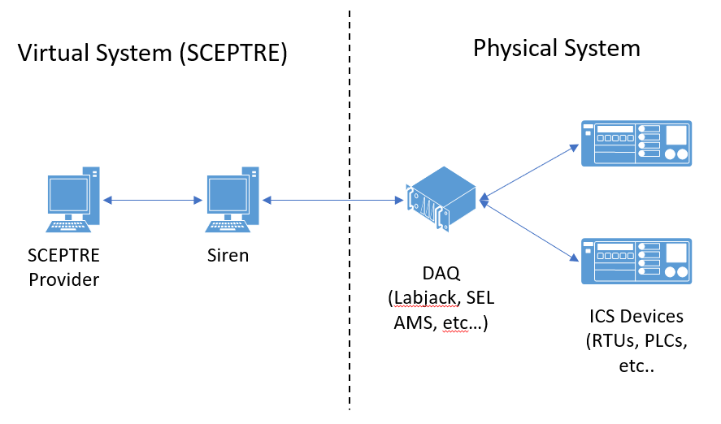

# Hardware-in-the-Loop

[HIL](glossary.md#acronyms) is an important part of many SCEPTRE
environments, as it adds significantly to the fidelity of the experiment. HIL
can take the form of:

+ Real vendor field device hardware (e.g., [SEL](glossary.md#acronyms) relays, Allen Bradley PLCs, etc)
+ Vendor software running on bare metal
+ Physical networking equipment (e.g., network taps, Cisco switches/routers/firewalls, etc.)
+ Physical sensors or actuators (e.g., solenoid values, thermocouples, [DPTs](glossary.md#acronyms), etc.)

Many of these HIL devices require a different method of integration at
different levels within the deployed environment. For example, Cisco networking
equipment only needs to be integrated at the TCP/IP network level, whereas an
SEL relay may need to be integrated at the network level and at the
[I/O](glossary.md#acronyms) level (i.e., end process simulation data needs
to stimulate the I/O of the physical device).

This guide will provide some overview of the various levels of HIL integration,
mostly focusing on integration at the network level.

## Looping in HIL at the Network Level

Looping HIL in at the network level is fairly straightforward, provided you
know what VLAN to add the HIL to, have enough physical
[NICs](glossary.md#acronyms) on the compute nodes, and understand the
differences between access and trunk ports.

Let's use the following network as an illustritive example. In this example
network, there are a combination of virtual and physical devices. The physical
devices you see are an Allen Bradley PLC, SEL substation relay, and an ABB
[RTU](glossary.md#acronyms). Each of these physical devices need to be
looped into the SCEPTRE environment at the network level. One way to do this is
to map a physical NIC on a compute host to the experiment VLAN that the
simulated network is on. Then the physical NIC would connect to the physical
HIL devices.



Let's run through the steps of looping in the ABB RTU at IP address
10.113.5.213. First, use the phēnix GUI to determine what VLAN the experiment
network is on. From the image below, it's easy to see the experiment VLAN
(`EXP_1`) is vlan 103.



In order for the ABB RTU to talk to the virtual devices deployed as part of the
experiment, we need to plug the RTU into a NIC on a compute node and map that
NIC to the `EXP_1` VLAN 103. So let's assume that we have already plugged the
ABB RTU into the back of one of the compute nodes (in this case we'll use the
host `halo6`), on interface named `eno2`.

> **NOTE!**

> The interface names for each host will likely be different. The interface
> will vary depending on the NIC, so don't be surprised to see other name
> formats, such as `eth1`, `ens3f1`, etc. Tools such as `ifconfig` or `ip`
> will help you determine which interface names exist.

To figure out which physical port maps to which interface name, use something
like `ethtool` to figure it out. For example, to figure out which physical port
`eno2` is on, you can run the following command:

```bash
sudo ethtool -p eno2
```

Once run, the link light LED on that particular interface will flash at an even
second interval.

> **NOTE!**

> For ethtool to work, the interface must already be enabled. To bring the
> interface up, just type `sudo ip link set dev <interface_name> up`.

At this point, you should have already identified the interface name (in our
case `eno2`), the physical port for that interface, and have plugged in the
physical device (in this case the ABB RTU) into that NIC port. Now to bridge the
physical port into the `EXP_1` VLAN 103, we need to run a
[openvswitch](glossary.md#terminology) command on the physical host, in this example `halo6`. To bridge `eno2` into the
experiment, we run the following command:

```bash
sudo ovs-vsctl add-port phenix eno2 tag=103
```

This ovs command adds the `eno2` port to the phēnix bridge, and tags all
traffic comming into the port with a VLAN tag of 103. The `tag=103` is important
for looping in standard HIL ICS devices, since it creates an access port on the
virtual switch, meaning it strips the VLAN tag off all traffic leaving the
server, but tags all traffic going into the server with the VLAN number. This is
important because most ICS devices down't know how to parse VLAN-tagged traffic.
Omitting the `tag=103` from the ovs command would instead create a trunk port on
the virtual switch, which leaves the VLAN tags on all traffic leaving the
server.

Once the ovs command above runs successfully, you should be able to ping the
physical HIL devices.

## Looping in HIL at a Deeper Level (Siren)

Most ICS related hardware use analog inputs (i.e. various voltage and current levels) to monitor the local physical system. These inputs cannot be manipulated over a network connection. In order to mimic this behavior there is a component called Siren included with SCEPTRE.

Siren provides a common interface between SCEPTRE and a HIL device. Siren works by mapping the tags in the [SCEPTRE Provider](glossary.md#terminology) to the I/O of a DAQ (Data Acquisition) device. Siren provides two-way communication with the DAQ and HIL device. It will receive simulated values from the SCEPTRE provider and communicates these to a HIL device through a DAQ. It will also receive values from the DAQ and sends these to the SCEPTRE Provider.


