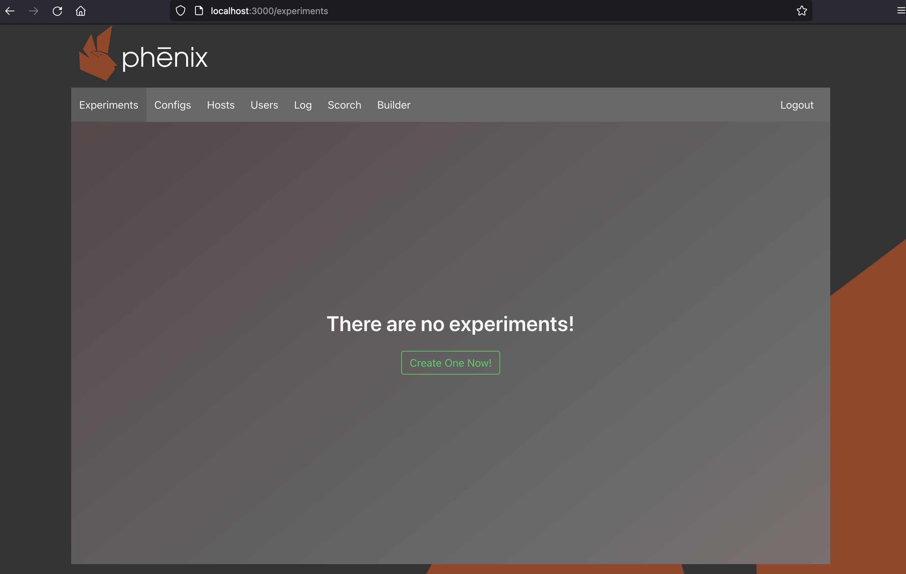
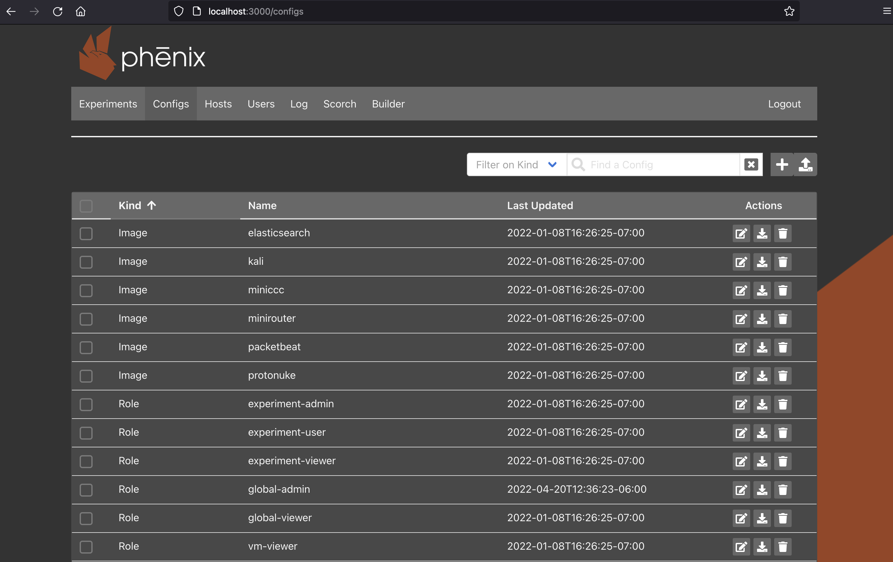
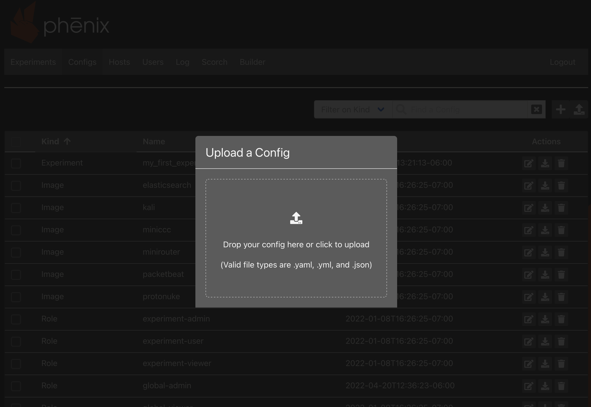
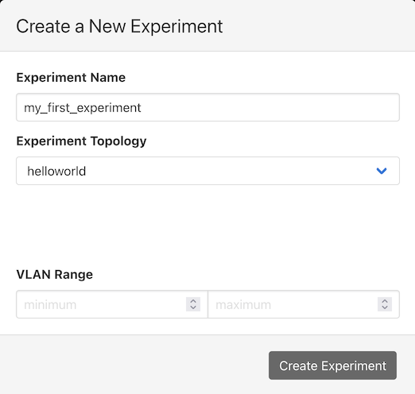
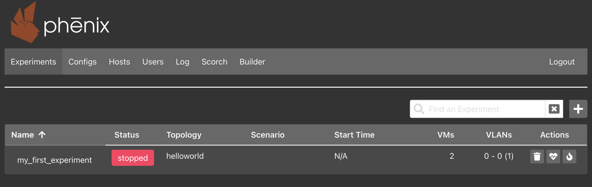
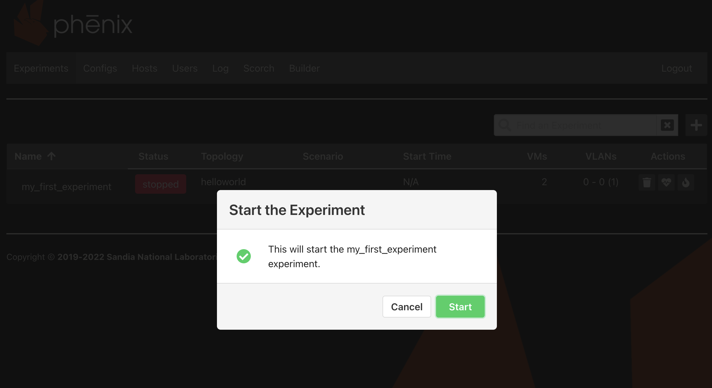
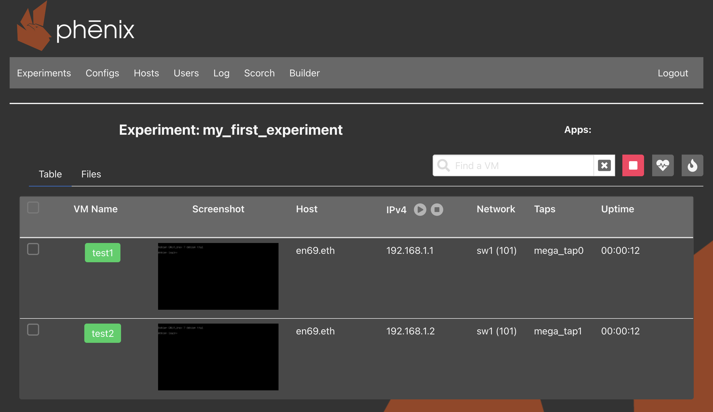
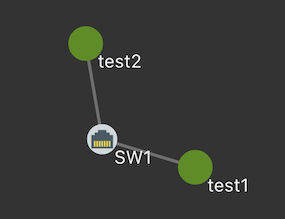
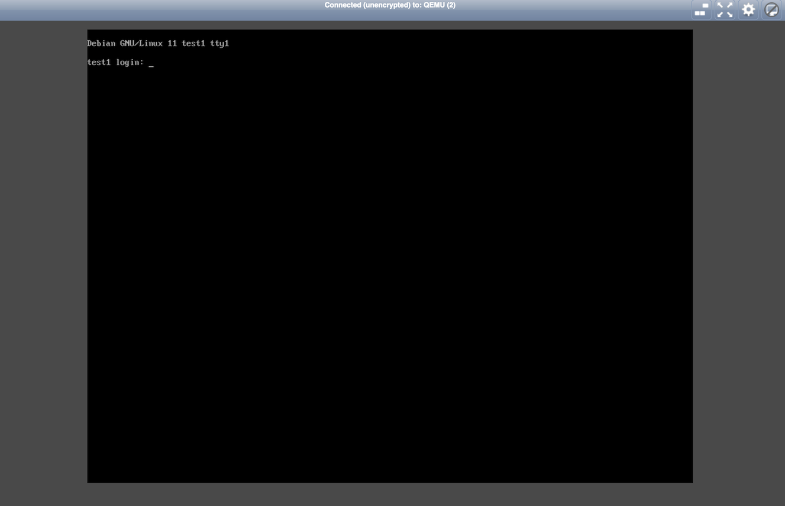
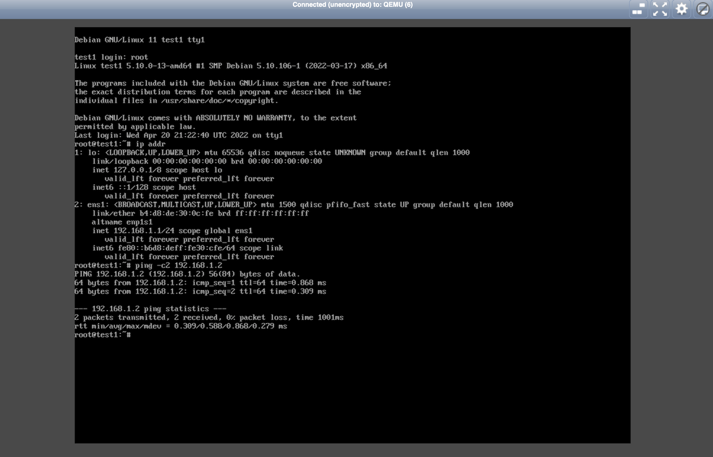

# Quick Start Guide

## Installation

The SCEPTRE platform is a combination of [COTS](about/glossary.md#cots) hardware, software, and Sandia-developed tools. Installation can be local (one computer) or distributed (multiple computers).

*For the best performance, install SCEPTRE using the [distributed](#distributed-installation-guide-recommended) installation guide.*

### Prerequisites

- Computer has Ubuntu 20.04 LTS or 22.04 LTS [installed](https://help.ubuntu.com/20.04/installation-guide/amd64/index.html) as the operating system
- Computer has internet access to install packages (or an [apt-mirror](01-cluster.md#apt-mirror) has been configured). If behind a web interception proxy, ensure `apt` is configured to use the proxy.
- All commands should be ran as `root`. Switch to the root user using `sudo su`.


### *Local Installation Guide (Quickest)*

For a local SCEPTRE installation, a single computer will act as both [headnode](#headnode) and [compute node](#compute-node).

1. Check [Prerequisites](#prerequisites) and ensure you are running as `root` user (`sudo su`).
2. Install required packages. Alternatively, follow [Docker's installation instructions for Ubuntu](https://docs.docker.com/engine/install/ubuntu/).

	```bash
apt update
apt install -y git docker.io docker-compose-plugin
	```

3. **Optional** If behind a proxy server, configure Docker to use the proxy

	```bash
mkdir /etc/systemd/system/docker.service.d/
cat <<EOF | sudo tee /etc/systemd/system/docker.service.d/http-proxy.conf
[Service]
Environment="NO_PROXY=*.example.com"
Environment="HTTP_PROXY=http://proxy.example.com:8080/"
Environment="HTTPS_PROXY=https://proxy.example.com:8080/"
Environment="no_proxy=*.example.com"
Environment="http_proxy=http://proxy.example.com:8080/"
Environment="https_proxy=https://proxy.example.com:8080/"
EOF
systemctl daemon-reload
systemctl restart docker
	```

4. Install topologies and base images

	```bash
mkdir -p /phenix
cd /phenix
git clone https://github.com/sandialabs/sceptre-phenix-topologies.git topologies
git clone https://github.com/sandialabs/sceptre-phenix-images.git vmdb2
	```

5. Install phēnix source files

	```bash
mkdir -p /opt
cd /opt
git clone https://github.com/sandialabs/sceptre-phenix.git phenix
	```

6. Install docker images
	- Pull pre-built docker containers. Useful for *users* of SCEPTRE.
        ```bash
docker pull ghcr.io/sandialabs/sceptre-phenix/phenix:main
docker pull ghcr.io/sandia-minimega/minimega/minimega:master
	    ```

	- Alternatively, build the docker containers from source. Useful for *developers* of SCEPTRE.
		```bash
cd /opt/phenix/docker
docker compose build
		```

    - **Tip** - If behind a web proxy, you must add `http_proxy` and `https_proxy` build args to the build command (Ex. `--build-arg http_proxy=http://proxy.example.com:8080 --build-arg https_proxy=http://proxy.example.com:8080`). Additionally, the `INSTALL_CERTS` build args may be required for custom certificates.

7. Set the `CONTEXT` environment variable and start up the SCEPTRE docker containers

	```bash
echo "export CONTEXT=$(hostname)" >> ~/.profile
source ~/.profile
cd /opt/phenix/docker
docker compose up -d
	```

8. **Optional** Add a few convenience aliases to your shell

	```bash
cat <<EOF >> ~/.bash_aliases
alias phenix='docker exec -it phenix phenix'
alias mm='docker exec -it minimega minimega -e'
alias mminfo='mm .columns name,state,ip,snapshot,cc_active vm info'
alias ovs-vsctl='docker exec -it minimega ovs-vsctl'
EOF
source ~/.bash_aliases
	```

9. Access the phēnix web GUI at `0.0.0.0:3000` (IP of the server, or `localhost`)
10. Run phenix command line:

    ```bash
# If you didn't configure the aliases, replace "phenix" with "docker exec -it phenix phenix"
phenix --version
phenix --help
    ```


### *Distributed Installation Guide (RECOMMENDED)*

A distributed SCEPTRE installation requires one [headnode](01-cluster.md#headnode) computer and one or more [compute nodes](01-cluster.md#compute-node).

**Headnode Install** - The headnode is the computer where experiment management tools are installed. Virtual machines do not run on this machine. For hardware requirements, see [Headnode Requirements](01-cluster.md#software-requirements)

1. Check [Prerequisites](#prerequisites) and ensure you are running as `root` user (`sudo su`).
2. Follow the steps in the [Local Installation Guide](#local-installation-guide-quickest) to deploy SCEPTRE on the headnode.
3. Stop the Docker containers

    ```bash
cd /opt/phenix/docker
docker compose stop
    ```


4. Configure NFS share. Setting up a Network File Share allows sharing of the base KVM images across multiple nodes. **Tip** - This is much more efficient than copying large base KVM images to each node individually.

    ```bash
echo '/phenix/images *(rw,sync,no_subtree_check)' >> /etc/exports
service nfs-kernel-server restart
    ```

5. Start up the docker containers

    ```bash
cd /opt/phenix/docker
docker compose up -d
    ```

6. Access the phēnix web GUI at `0.0.0.0:3000` (IP of the server, or `localhost`)

**"Compute Node" Install** - The compute node is the computer where virtual machines run. For hardware requirements, see [Compute Node Requirements](01-cluster.md#software-requirements_1)

1. Check [Prerequisites](#prerequisites)
2. Install required packages

	```bash
apt update
apt install -y nfs-common openvswitch-switch qemu-kvm tmux vim
	```

3. Mount NFS share. Replace `X.X.X.X` with the IP address of the headnode.

    ```bash
mkdir -p /phenix/images
echo 'X.X.X.X:/phenix/images /phenix/images nfs auto,rw 0 0' >> /etc/fstab
mount -a
    ```


## Getting Started - Helloworld Experiment

1. Build the required backing image

	- The helloworld topology requires one VM backing image called `ubuntu.qc2`.
	- Build this image via the CLI using the following commands on the headnode:

		```bash
		phenix image create -T /phenix/vmdb2/scripts/ubuntu --format qcow2 --release focal -c ubuntu
		phenix image build ubuntu -o /phenix -c -x
		mv /phenix/ubuntu.qc2 /phenix/images
		```

2. Access phenix web

	- The phēnix web interface allows for creating, configuring, and managing SCEPTRE experiments. First open up `http://<Headnode IP address>:3000` in your browser, and you'll see the home page displayed:

		

3. Upload topology

	- You must first upload the topology file for phēnix to ingest. From the home page, click on the `Configs` tab to navigate to the configurations page. Next click the  button and drag/drop the `helloworld.yaml` file into the dialog box to upload it:

		
   		

	-  Alternatively, you can upload the topology via the CLI using the following command on the headnode:

		```bash
		phenix config create /phenix/topologies/helloworld.yaml
		```

	- You should now see the `helloworld` topology in the configs table:

		

4. Create Experiment

	- Navigate back to the home page by clicking the `Experiments` tab.
	- Click the new experiment  button to open the create experiment dialog.
	- Fill out the dialog as shown (leaving everything else blank) and then click the  button:

		- Experiment Name: __*my_first_experiment*__
		- Topology: __*helloworld*__

		

	- Alternatively, you can create the experiment via the CLI using the following command on the headnode:

		```bash
		phenix exp create my_first_experiment -t helloworld
		```

5. Deploy Experiment

	- Your newly created experiment will appear in the experiments table:

		

	- To start the experiment, click the  button and then click :

		

	-  Alternatively, you can deploy the experiment via the CLI using the following command on the headnode:

		```bash
		phenix exp start my_first_experiment
		```

	- Once your experiment starts up, its status will be marked as . Click on the name of the experiment , and phēnix will switch to the experiment info page:

		

	- **Tip** - Click on the State of Health  button to see a network topology map, and click the Go Back  button to return to the Experiment Info page.

		

6. Test

	- Congratulations! You've created and deployed your first SCEPTRE experiment.
	- From here you can interact with individual Virtual Machines (VMs) by clicking on the respective screenshot, which will open a new browser tab for that VM:

		

	- Login as the `ubuntu` user (with password `ubuntu`) for either of the VMs and trying pinging the other IP address:

		

## Getting Started - SCEPTRE-on-a-Platter (SOAP)

Now that you can run the basic helloworld topology, we are ready to run a topology of a notional ICS. This topology, called SCEPTRE-on-a-Platter (SOAP), models a notional SCADA system for a 300 bus microgrid system. The model uses PyPower to model the physical process itself, Ignition SCADA software, and additionally includes the ControlThings.io environment to additionally provide a testing suite for the ICS environment.

1. Build additional required backing images
	```bash
	phenix image create -O /phenix/vmdb2/overlays/bennu,/phenix/vmdb2/overlays/brash -T /phenix/vmdb2/scripts/aptly,/phenix/vmdb2/scripts/bennu --format qcow2 --release focal -c bennu
	phenix image build bennu -o /phenix -c -x
	```
2. Request other backing images
	- SOAP uses other backing images that are not currently supported by phēnix image. To obtain a copy of these backing images, email `wg-sceptre-core@sandia.gov` with your request.
3. Access phēnix web
4. Upload topology and scenario files
	- soap-topology.yaml
	- sceptre.yaml
	- soh.yaml
	- soap-scenario.yaml
5. Create Experiment
	- Create an experiment using the `soap` topology.
	- Additionally, select the `soap` scenario file under the "Experiment Scenario" dropdown.
	- Alternatively, you can create the experiment via the CLI using the following command on the headnode:
		```bash
		phenix exp create my_soap_experiment -t soap -s soap
		```
6. Deploy Experiment
7. Test
	- For details on how to navigate and test the experiment, read the [SOAP User Guide](https://github.com/sandialabs/sceptre-phenix-topologies/blob/main/soap/SOAP_User_Guide__UUR__20200817.pdf)


## Getting Help

To get help with SCEPTRE, contact us at `wg-sceptre@sandia.gov`.
